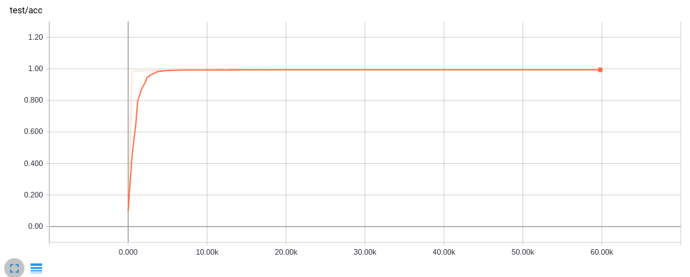

# Capsnet-tensorflow-combine


*Download dataset*

```
$ cd code
$ mkdir -p data/mnist
$ wget -c -P data/mnist http://yann.lecun.com/exdb/mnist/{train-images-idx3-ubyte.gz,train-labels-idx1-ubyte.gz,t10k-images-idx3-ubyte.gz,t10k-labels-idx1-ubyte.gz}
$ gunzip data/mnist/*.gz
```

*Run train and eval*
```
$ python train_eval.py
```

*Test Accurcay: 99.43% at 40K times as the paper's*

